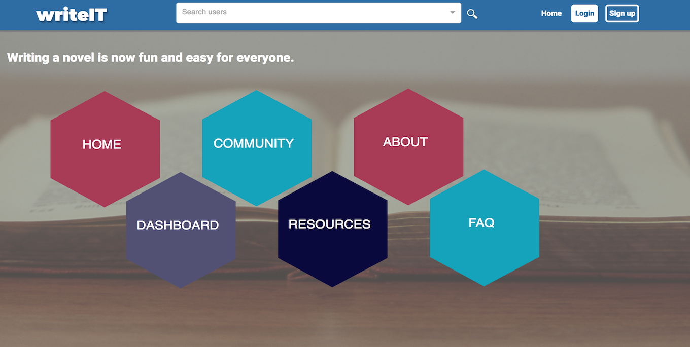

# writeIT


## About
WriteIT is a productivity tool for writers, offering a variety of ways to organize, structure, and plan manuscripts. It also incorporates a social networking feature that allows writers to add friends, share their work, and receive or give feedback.

## Team Members
- [Chad Mckee]
- [Porscha Johnson]
- [Chris Boeckel]
- [Carla Severe]

[Chad Mckee]:<https://github.com/chadm9>
[Porscha Johnson]: <https://github.com/Porscha07>
[Chris Boeckel]: <https://github.com/cboe07>
[Carla Severe]:<https://github.com/csevere>
[here]:<>

## Languages and Technologies

JavaScript | JSX | React | Redux | Node.js| Express | MySQL | HTML | CSS | Sass | A.W.S | jQuery | React-twitter-widgets | Wordnik API


## Strategy

A week before the project started, we got together in meetings to brainstorm our project's scope and functionality by creating  wireframes, discussing required technologies, and finalizing our team's roles and responsibilities. We  split into two mini groups to work on the front and back end of the project, and met every couple of days to ensure we were on track and to avoid merge conflicts while pushing and pulling our code. We decided to use several API's for the dictionary and thesaurus functionality for the user. We mob programmed some aspects of the front and back end to ensure each team member had an understanding.

## Site Walkthrough

 ### Home Page
The home page is the main hub of the site, users are able to learn more about the site via the FAQ's page, go to the dashboard to edit their profile and add friends to engaging with the community on shared topics of interest.

<p align='center'>
  
</p>

### User Login Page
User login in page after they have registered and provided detailed information such as their twitter handle,occupation and location.

<p align='center'>
  
 </p>


 ### Resources
 The resources page provides writers with a top ten list of books to help guide them though various aspects of the writing process. 

<p align='center'>
  
</p>

### Write Menu
Once a user creates a book, they can answer various questions regarding each topic below.

<p align='center'>
  
 </p>

### User Profile Page
Users are able to change their profile picture, post messages and store the books they create and edit.

 <p align='center'>
 	
 </p>
 
## Challenges

### Uploading Book Contents to WriteIt
WriteIt assists its writers in the creative writing process by
allowing them to store ideas about their works for review using
the guided writing process.  The following code snippets demonstrate
the uploading of book data to the WriteIt database.
<br><br>
On the front end, writers can fill in information about their work
and click a submit button to upload their input to the database.  
The following code snippet demonstrates the submit button's handle
click function.
```JavaScript
    handleNotes(event){
        //Prevent the default button submit behavior when the
        //user clicks to upload a new notepad.
        event.preventDefault();
        //Get the current user's username from Redux
        var username = this.props.registerResponse.name;
        //Get the title of the book, which is stored in the url.
        var book = this.props.match.params.book;
        //Get the text input that user is attempting to upload.
        var notepad = document.getElementById('text').value;
        //Get the unique database ID of the associated with the 
        //notepad if it existed previouslu.
        var id = this.props.location.search.slice(4);
        //Call the Redux notepad action to send the data to the server
        this.props.notePadAction({
            username: username,
            book: book,
            notepad: notepad,
            id: id
        });
        //Send the user back to the write menu while storing the book
        // they are wooking on in the url.  
        this.props.history.push(`/write/${this.props.match.params.book}`);
    }
```
After the writer clicks submit, the information they entered is sent to 
the WriteIT database for storage.  The following code snippet demonstrates
the back-end storage of the user data on the database.
```JavaScript
//Define the route to store notepad data on WriteIt's database
router.post('/notepad', (req, res)=>{
    //Read in the variables associated with the post request.
    var username = req.body.username;
    var book = req.body.book;
    var notepad = req.body.notepad;
    var id = req.body.id;
    //Define the appropriate SQL queries.  The appropriate queries
    //to use are based on the input data.
    
    //Pull previous notepad entries corresponding to the username and book title.
    var notePadLetterQuery = `SELECT * FROM notepad WHERE username = ? AND book = ? AND notepad = ?`;
    //Define an insert query for new entries.
    var insertNotePadQuery = `INSERT INTO notepad
        (notepad,username,book) VALUES (?,?,?)`;
    //Define an update query for previous entries
    var updateNotePadQuery = `UPDATE notepad SET notepad='${notepad}' WHERE username='${username}' AND book='${book}';`;
    //If a unique id exists, update the entry corresponding to it.
    if(id!==''){
        var editNotePadQuery = `UPDATE notepad SET notepad='${notepad}' WHERE id='${id}';`;
        connection.query(editNotePadQuery, (error2, results2)=>{
            console.log('update')
            if(error2) throw error2;
            res.json({
                msg: 'Updated'
            })
        })
    }else{
        //If no id exists, and no database entry with the same data exists,
        //write the new entry to the database and send a response to the front-end.
        connection.query(notePadLetterQuery, [username, book, notepad], (error,results)=>{
            if(error) throw error;
            if(results.length === 0){
                connection.query(insertNotePadQuery, [notepad, username, book],(error2, results2)=>{
                    if(error2) throw error2;
                    res.json({
                        msg: 'Inserted'
                    })
                })
            }
        })
    }
});

