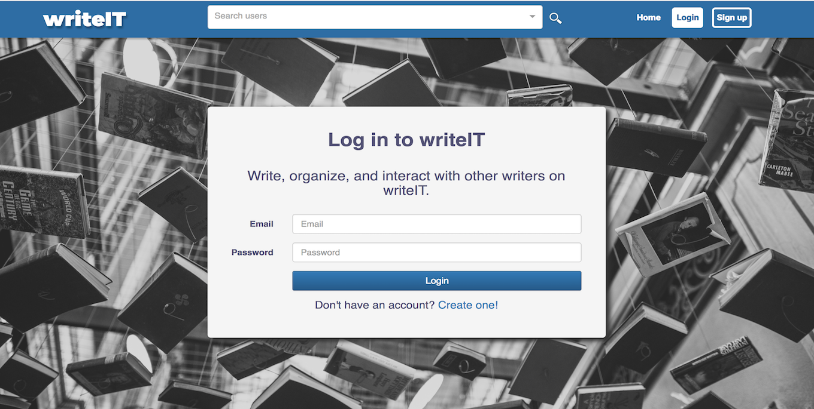
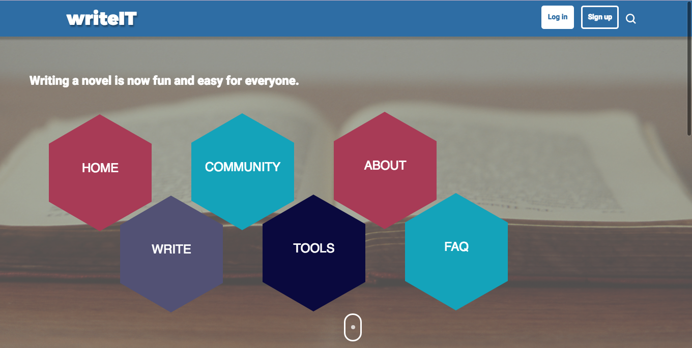
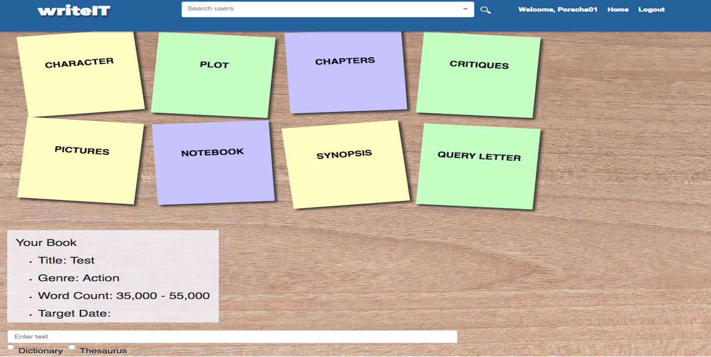
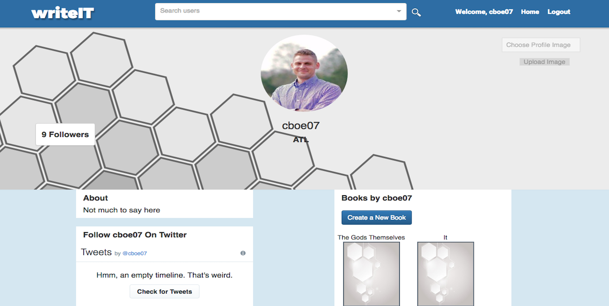

# writeIT

## About
WriteIT is a productivity tool for writers, offering a variety of ways to organize, structure, and plan manuscripts. It also incorporates a social networking feature that allows writers to add friends, share their work, and receive or give feedback.

## Team Members
- [ Chad Mckee]
- [ Porscha Johnson]
- [ Chris Boekel]
- [ Carla Severe]

## Languages and Technologies

JavaScript | JSX | React | Redux | Node.js| Express | MySQL | HTML | CSS | Sass | A.W.S | jQuery | React-twitter-widgets |

## Strategy

A week before the project started, we got together in meetings to brainstorm our project's scope and functionality by creating  wireframes, discussing required technologies, and finalizing our team's roles and responsibilities. We  split into two mini groups to work on the front and back end of the project, and met every couple of days to ensure we were on track and to avoid merge conflicts while pushing and pulling our code. We decided to use several API's for the dictionary and thesaurus functionality for the user. We mob programmed some aspects of the front and back end to ensure each team member had an understanding.

## Site Walkthrough

### User Login Page
User login in page after they have registered and provided detailed information such as their twitter handle,occupation and location.

  
 

 ### Home Page
The home page is the main hub of the site, users are able to learn more about the site via the FAQ's page, go to the dashboard to edit their profile and add friends to engaging with the community on shared topics of interest.

  

 ### Resources
 The resources page provides writers with a top ten list of books to help guide them though various aspects of the writing process. 

  

### Write Menu
Once a user creates a book, they can answer various questions regarding each topic below.

  
 

### User Profile Page
Users are able to change their profile picture, post messages and store the books they create and edit.

 

 	
 

 
## Challenges

TBD